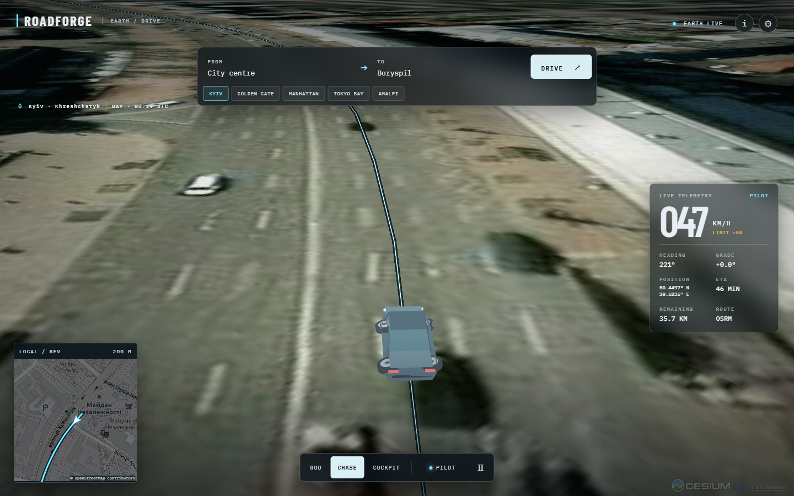

# RoadForge

**A virtual vehicle on the real Earth.** Open a Cesium globe, pick a real route, and ride with a geometric pilot in GOD, CHASE, or COCKPIT view.



## Run on Windows

Node.js 20.19+ or 22.12+ is required. In PowerShell:

```powershell
git clone https://github.com/Galactic717/roadforge.git
cd roadforge
npm install
npm run dev
```

Open **http://127.0.0.1:5173**. Click **KYIV** to start immediately. The first view is satellite Earth; the preset opens a cached real road route and starts the car in PILOT mode. The other presets cover Golden Gate Bridge, Manhattan, Tokyo Bay, and the Amalfi Coast.

## Keys and network services

**No key is required.** Esri World Imagery supplies satellite imagery, the bundled preset routes were fetched from public OSRM, custom routes call public OSRM, place search uses OpenStreetMap Nominatim, and the BEV inset uses OpenStreetMap tiles. Attribution appears in the viewer and inset. Network access is required for map imagery and custom search/routing; cached routes still work if OSRM is down.

Open the gear **POWER-UP** panel to paste optional keys. A Cesium ion token enables World Terrain and, in Cinematic quality, Google Photorealistic 3D Tiles when that asset is enabled on the account. A Mapbox token replaces Nominatim and OSRM for place search and directions. Tokens are stored only in the browser's `localStorage`; do not put them in source control. Provider terms, access, and possible charges apply.

The public Nominatim and OSRM endpoints are shared community services, so custom route availability and response time can vary. The preset route JSON files under `web/public/routes/` keep the first drive independent of live routing.

## Controls

| Action | Control |
| --- | --- |
| Start a drive | Click a preset, or search FROM / TO and click DRIVE |
| Change camera | GOD / CHASE / COCKPIT buttons or `C` |
| Take manual control | `WASD`, arrow keys, or touch controls |
| Resume pilot | PILOT button or `P` |
| Pause | Pause button or `Space` |
| Share | Copy the URL hash; it includes mission or route and camera |

The car uses a fixed-step bicycle model with wheelbase, steering rate, throttle, brake, and drag. PILOT is a pure-pursuit route follower with curvature-aware speed and route reacquisition. The body and spinning wheels are original procedural glTF assets generated by `web/tools/build_car.py`.

## Development

```powershell
npm test
npm run build
npx playwright install chromium
npm run smoke
```

`npm run smoke` launches Vite, opens Chromium, checks the globe, starts the cached Kyiv drive, and verifies movement, HUD, and camera switching. The product is a vanilla JavaScript Vite app under `web/`. The original Python 2D imitation-learning project is preserved as historical material in `legacy/2d-lab/` and is not the product runtime.

## Limitations

RoadForge is a visual simulation. It does **not** control a real vehicle, perform autonomous driving, perceive traffic, obey live traffic rules, or provide safety guidance. The route follows public map geometry, not lane-level HD maps. Keyless mode uses an ellipsoid surface; real terrain and photogrammetry require a Cesium ion token. Speed limits shown as `~` are heuristics, not legal road-speed data. No traffic, rain, or learned policy is included.

MIT license. See [LICENSE](LICENSE).
