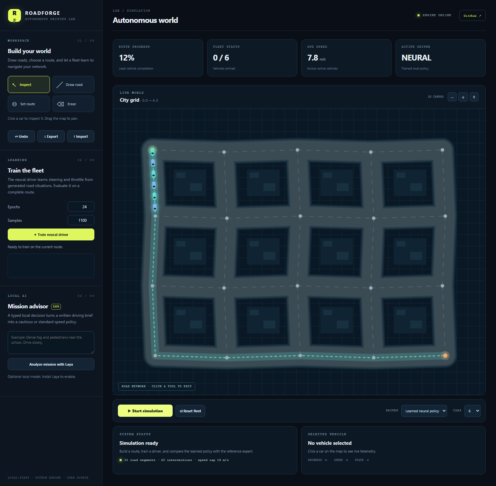

# RoadForge

**Build a road world. Train a fleet. Watch autonomous cars navigate the roads you drew.**

RoadForge is a local-first autonomous-driving laboratory written in Python with a dependency-free canvas interface in plain JavaScript. It combines an editable road graph, shortest-path routing, deterministic vehicle dynamics, road-edge sensors, a trainable neural driver, live fleet telemetry, and reproducible evaluation. The optional [Laya](https://huggingface.co/convaiinnovations/laya) integration converts a written mission brief into a typed driving-mode decision on your own machine.



> RoadForge is a 2D software simulation. It is not a real-vehicle controller or a claim of road safety.

## What you can do

- **Build a connected world:** click to add intersections and roads, erase segments, undo edits, import/export JSON, and save locally.
- **Plan a route:** select start and destination; Dijkstra's algorithm finds the shortest connected path.
- **Drive a fleet:** compare a geometric reference driver with a neural policy across 1, 6, or 12 autonomous cars.
- **Train on your own map:** road-relative examples are generated from the currently selected route. A small neural network learns steering and throttle through backpropagation. The learned weights drive the cars without consulting the reference policy at inference time.
- **Inspect behavior:** view route progress, speeds, stops, completion, per-car telemetry, and training loss.
- **Apply a written mission:** when Laya is installed, classify a mission note as standard or cautious driving and cap speed accordingly. Low-confidence results use the cautious setting.

## Quick start

Python **3.11 or newer** is required. No runtime packages, API keys, accounts, GPU, or Node build step are needed for the base app.

```bash
git clone https://github.com/Galactic717/roadforge.git
cd roadforge
python -m venv .venv
# Windows: .venv\Scripts\activate
# macOS/Linux: source .venv/bin/activate
pip install -e .
roadforge serve
```

Open **http://127.0.0.1:8765**. The included city and pretrained neural driver are ready to run. The app binds to localhost by default.

### First five minutes

1. Press **Start simulation** to watch the included fleet.
2. Switch **Driver** between the reference and learned policies.
3. Choose **Draw road** and click two points to add a connection.
4. Choose **Set route** and click start and destination nodes.
5. Press **Train neural driver**. The resulting model becomes the active driver when training finishes.

The **Import** and **Export** buttons exchange a portable JSON file containing the world and selected route. Local edits and custom model weights are saved under `data/` and ignored by Git.

## Command line

```bash
roadforge train --epochs 24 --samples 1100 --seed 7 --output data/model.json
roadforge evaluate --model data/pretrained_model.json
roadforge serve --port 8765
```

`roadforge train` trains on the included city. The web app trains on whichever valid world and route you built in the editor. A fixed seed makes repeated runs comparable.

## How learning works

The browser only draws the world and sends user actions. Python owns road validation, routing, vehicle physics, observations, policy inference, training, and persistence.

```text
road graph → shortest route → car + five road-edge rays
                                ↓
                    route-relative observation
                      ↙                   ↘
             reference driver       neural network
             (training labels)       (steer, throttle)
                      ↘                   ↙
                     deterministic vehicle step
                                ↓
                       progress / arrival / stop
```

The policy is an 8-input, 12-hidden-unit, 2-output tanh network. Training samples vary position, heading, and speed along the chosen route; the reference driver supplies control labels. Evaluation runs a full, closed-loop trip with learned weights and reports arrival and route completion. See [architecture](docs/ARCHITECTURE.md) and the [model card](docs/MODEL_CARD.md) for design choices and limitations.

### Reproducible reference result

On the included city, the committed model was trained with seed `7`, `1,100` generated samples, and `24` epochs. `roadforge evaluate` reports:

| Driver | Arrived | Route completion | Simulation ticks |
| --- | ---: | ---: | ---: |
| Reference | yes | 99.5% | 800 |
| Learned | yes | 99.4% | 789 |

Arrival triggers within 13 simulation units of the goal, so completion can be slightly below 100%. These are deterministic software-simulation results on the bundled map, not a real-world benchmark.

## Optional local Laya advisor

Jev-style typed decision models are commonly used for classification, routing, risk scoring, and workflow selection. RoadForge applies that pattern to a **written driving mission**, where it fits naturally: Laya sees the note, answers a `choice` question about driving mode and a `score` question about stated road risk, and the app applies a bounded speed cap. The vehicle's geometric controller still owns steering and road boundaries.

```bash
pip install laya
roadforge serve
```

The first Laya call may download model weights. It is optional; the simulation and neural driving work offline without it after installation. RoadForge does not bundle or upload Laya weights. See [decision layer](docs/LAYA.md) for the exact question schema, fallback, and integration status.

## Development

```bash
pip install -e ".[dev]"
pytest -q
ruff check src tests
node --check web/app.js
```

GitHub Actions runs Python tests on Windows and Ubuntu, syntax-checks the browser code, and enforces Ruff. See [contributing](CONTRIBUTING.md), [security](SECURITY.md), and [API](docs/API.md).

## Repository layout

```text
src/roadforge/  World model, routing, simulation, learning, local server, Laya adapter
web/            Plain JavaScript canvas interface and CSS
data/           Committed sample weights; ignored local worlds and new models
tests/          Geometry, learning, server, and decision-layer tests
docs/           Architecture, API, model card, integration notes
.github/        Continuous integration and issue templates
```

## Inspiration and provenance

The project brief was inspired by building a virtual road world in plain JavaScript. RoadForge uses a Python engine to meet its primary implementation goal and plain JavaScript only for the browser surface. [Google ARTEMIS](https://github.com/google/artemis) informed the standard of documentation and verification, not this codebase. [God's Eye View](https://github.com/bilawalsidhu/gods-eye-view) informed the emphasis on an explorable, local-first visualization; no code or media was copied. [Laya](https://huggingface.co/convaiinnovations/laya) is an optional, separately installed decision model. All project code and visual assets here are original.

## License

MIT. See [LICENSE](LICENSE).
